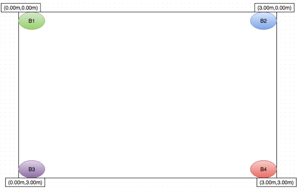

# IoT-MicroLocation

[](./License)

An end-to-end Internet of Things (IoT) software package for Micro-Location, Proximity Aware services and Geofencing using Apple's iBeacons and set of Cloud services. The project is a collaboration effort of the teams from Purdue University and North Carolina State University advised by Dr. Ioannis Papapanagiotou - ipapapa@ncsu.edu.

# Readme

Below you may find information about the Java server application, Bluemix installation, the iOS application and the Raspberry Pi.

The [Wiki](https://github.com/ipapapa/IoT-MicroLocation/wiki) contains further information about additional components that can be added to the project.

## Examples and Demos
[Proximity based interaction with iBeacons at NCSU Hunt Library](http://www.youtube.com/watch?v=AwckTkpN4-Y)
 
[Microlocation and Geofencing - Purdue University](http://www.youtube.com/watch?v=QCtc7z6PC70)

Our research paper of how iBeacons can be used for MicroLocation: F. Zafari, I. Papapanagiotou, ["Enhancing iBeacon based Micro-Location with Particle Filtering"](http://people.engr.ncsu.edu/ipapapa/Files/globecom2015.pdf), IEEE GLOBECOM 2015, San Diego CA.

[1mx1m Accuracy - North Carolina State University](https://www.youtube.com/watch?v=uQul5LDdpLc)

[Design Day Demo and Project Overview - North Carolina State University](https://www.youtube.com/watch?v=3bmHBxyk1qc)

[Senior Design Group ECE NC State University - Internet of Things with iBeacons](https://www.youtube.com/watch?v=rZIDv4PnV2U)


# Technical Summary


The Microlocation system utilizes Bluetooth Low Energy (BLE) technology of iBeacons to locate a user. Multiple beacons are placed in a room and based on trilateration algorithms the user's mobile device can be located. The iBeacon packets broadcasted have the essential data of each beacon such as UUID, Proximity, RSSI, Major and Minor numbers embedded into the payload of each packet. The iPhone receives this data and through HTTP POSTs the mobile device puts this data into a JSON object and sends it to a server whether it be local (Apache Tomcat) or in the cloud (Bluemix). The server is where the power house is where it processes the data coming through and based on RSSI values from multiple beacons coming in it will trilaterate the user's position and then run a particle filtering algorithm to make it more accurate. Once the user is located the server will reply back in the form of a JSON Response Object and the iPhone will do a iBeacon packet inspection to find the x and y coordinates that the server has calculated for the user's location. The iPhone plots this onto the map of the room and the user therefore will know where they are located. Now knowing the location of the user, the server simultaneously sends a signal to the cloudant database indicating that the user is nearby a device. The Raspberry Pi polls the Cloudant Database for the things that it knows about constantly until something changes in the database. Once a change has been made (i.e. a user is near or far from a device) the device state changes and turns on or off.


## Java application 

### Getting Started (WemoController3 & interactiveRoom) 

After successfully importing the Java project and running it on a local TomCat server or in the cloud on a BlueMix server, there are only a few parts of of the Java application that will change based on your environment. These will basically be how you always initialize your server to a new environment. 

#### WemoController3:

Open in the project in an IDE or open WemoController3.java in a text editor and scroll to line 105. Here we change the points of our landmarks (“beacons”). Insert the meter locations of the beacons within the room. On line 116, also change the array size of array variable ‘re’ to the amount of beacons the user has within the room. In lines 374, 378, 382, 386 also change the minor values of the beacons you are working with.

For example: (B1 is a beacon minor value of 1)





```java
    final Point[] landmarks = new Point[]{new Point(0.00d, 0.00d), new Point(3.00d,0.00d), 
    new Point(0.00d,3.00d), new Point(3.00d,3.00d)};
```


Note: Feel free to use the provided FeetToMeter function within the Java functions if necessary


```java
    private iBeacon[] re = new iBeacon[4];
```


For lines 374, 378, 382, 386 change the location of where the rssi value is stored within the iBeacon array to index of the landmarks array.

So since B1 is at location ‘0’ within “landmarks” array, makes sure the rssi value of B1 is at location ‘0’ within “re” array.

#### interactiveRoom:

Starting at line 93, change the “landmark” locations as shown in the WemoController3 instructions.

Since we are interacting with Things based on proximity rather than the microlocation algorithm, the minor values of the iBeacons on lines 401 and 407 need to be changed. We created an array for each “Thing” we wanted to interact with. Within this array are RSSI values that come from the iBeacon that is near a “Thing”. Depending on the array size from lines 101 and 102, we took that many samples from the beacon and placed them into the array. Next we took the average – if it is within the threshold value we would turn the “Thing” on, otherwise we would turn the “Thing” off. Please see lines 433-507. 

To interact with CloudantDB, there are two changes that have to be made. In interactiveRoom.java you must change line 89 to your current revision number within your database. Secondly, in PostToDatabase.java, edit lines 40 and 46 to your username and password.


