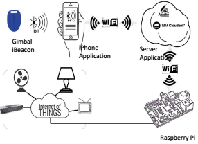

# IoT-MicroLocation

An end-to-end Internet of Things (IoT) software package for Micro-Location, Proximity Aware services and Geofencing using Apple's iBeacons, mobile app (Android and iOS) and a set of Cloud services. The project is a collaboration effort across multiple institutions advised by Dr. Ioannis Papapanagiotou - ipapapa@ncsu.edu.

## Institutions
* Purdue University, West Lafayette IN, USA
* NC State University, Raleigh NC, USA
* University of New Mexico, Albuquerque NM, USA

# Technical Summary

The Microlocation system utilizes Bluetooth Low Energy (BLE) technology of iBeacons to locate a user. Multiple beacons are placed in a room and based on trilateration algorithms the user's mobile device can be located. The iBeacon packets broadcasted have the essential data of each beacon such as UUID, Proximity, RSSI, Major and Minor numbers embedded into the payload of each packet. The iPhone receives this data and through HTTP POSTs the mobile device puts this data into a JSON object and sends it to a server whether it be local (Apache Tomcat) or in the cloud (Bluemix). The server is where the power house is where it processes the data coming through and based on RSSI values from multiple beacons coming in it will trilaterate the user's position and then run a particle filtering algorithm to make it more accurate. Once the user is located the server will reply back in the form of a JSON Response Object and the iPhone will do a iBeacon packet inspection to find the x and y coordinates that the server has calculated for the user's location. The iPhone plots this onto the map of the room and the user therefore will know where they are located. Now knowing the location of the user, the server simultaneously sends a signal to a MySQL database indicating that the user is nearby a device. The Raspberry Pi polls the MySQL Database for the things that it knows about constantly until something changes in the database. Once a change has been made (i.e. a user is near or far from a device) the device state changes and turns on or off.

# Readme

The [Wiki](https://github.com/ipapapa/IoT-MicroLocation/wiki) contains further information about additional components that can be added to the project.

## Examples and Demos

### Research Papers

A couple of research papers of how iBeacons can be used for MicroLocation or proximity utilizing the software of this repository:

* F. Zafari, I. Papapanagiotou, ["Enhancing iBeacon based Micro-Location with Particle Filtering"](http://ipapapa.github.io/Files/globecom2015.pdf), IEEE GLOBECOM 2015, San Diego CA.

* F. Zafari, I. Papapanagiotou, M. Devetsikiotis, T.J. Hacker, ["Enhancing the Accuracy of iBeacons for Indoor Proximity-based Services"](http://ipapapa.github.io/Files/icc2017_iot.pdf), IEEE ICC 2017, Paris, France

A detailed survey about this area: 

* F. Zafari, I. Papapanagiotou, K. Christidis, ["Micro-location for Internet of Things equipped Smart Buildings"](http://ipapapa.github.io/Files/IEEEIOT2015.pdf), IEEE Internet of Things Journal, pp. 96-112, Feb. 2016 ([publisher link](http://ieeexplore.ieee.org/xpl/freeabs_all.jsp?arnumber=7120085))

### Videos
* [NC State University - Senior Design Group 2016 - Contextual Awareness in a Retails Store](https://www.youtube.com/watch?v=8U9wsc6tMWU)

* [NC State University - Senior Design Group 2015 - A smart building with iBeacons](https://www.youtube.com/watch?v=rZIDv4PnV2U)

* [NC State University - Summer Internship 2015 - Proximity based interaction with iBeacons at NCSU Hunt Library](http://www.youtube.com/watch?v=AwckTkpN4-Y)
 
* [Purdue University - Microlocation and Geofencing](http://www.youtube.com/watch?v=QCtc7z6PC70)

* [NC State University - 1mx1m Accuracy](https://www.youtube.com/watch?v=uQul5LDdpLc)

* [NC State University - Design Day Demo and Project Overview](https://www.youtube.com/watch?v=3bmHBxyk1qc)

